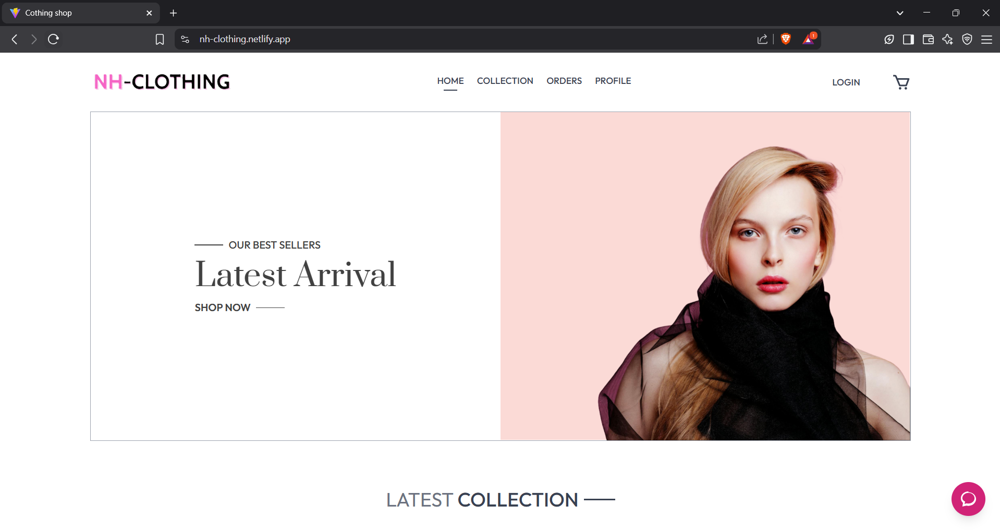

# 🛍️ Clothing Shop

A full-featured online clothing store supporting both **web** and **mobile platforms**, allowing customers to browse and purchase products while enabling sellers to manage their stores. The project also explores AI-powered virtual try-on features.

## 🚀 Features

### 👤 Customers
- Browse and search clothing items
- View detailed product pages with images
- Add items to cart and place orders
- Can complete payment using VNPAY
- Manage profile and order history
- Chatbot suggesting products on the platform

### 🛍️ Sellers
- Register and manage shop profile
- Upload and manage clothing products
- Track customer orders

### 🛠️ Admin
- Manage users and shops
- Monitor system activity

### 🤖 AI-Powered Virtual Try-On *(Research Phase)*
- Simulate how clothes look on users using deep learning
- Currently runs on Google Colab (not yet deployed to production)

---

## 📱 Platforms

| Platform | Stack |
|----------|-------|
| 🌐 Web | ReactJS, Tailwind CSS |
| 📱 Mobile | React Native |
| 🔙 Backend | NestJS (REST API) |
| 🛢️ Database | PostgreSQL (via Prisma) |
| 🧠 AI Research | Python (Google Colab) |

---

## 🔗 Links

- Live Website: [https://nh-clothing.netlify.app](https://nh-clothing.netlify.app)
- GitHub: [https://github.com/NhungNguyen04/Clothing-Shop-Main](https://github.com/NhungNguyen04/Clothing-Shop-Main)
- Model VITON-HD: [Google Colab](https://colab.research.google.com/drive/1JgaSz55tvnLH7_almI0BR0T5KoL-Kc6H?usp=sharing)

---
